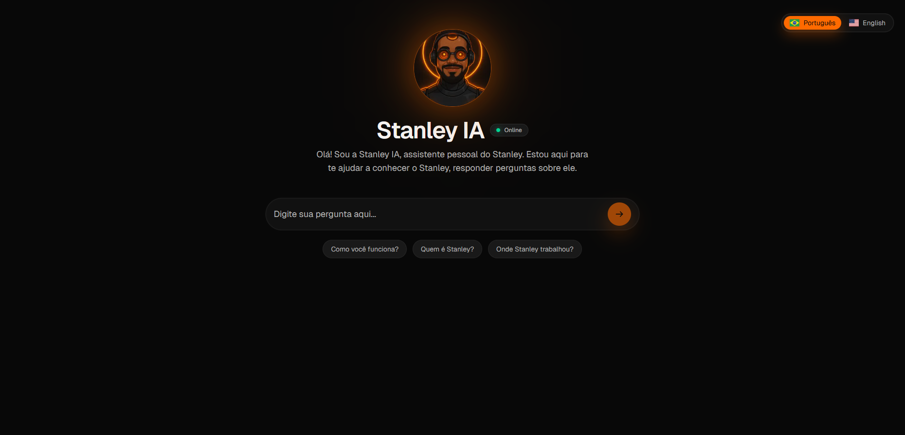
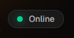
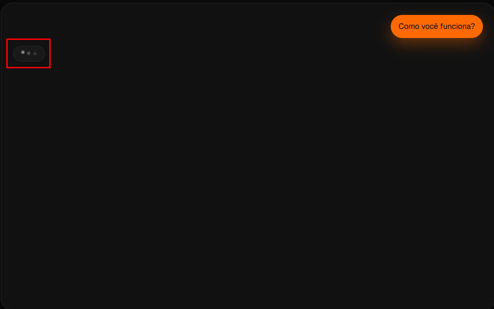
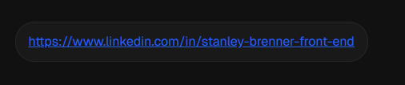

Stanley IA — Frontend (Next.js) + API (FastAPI/RAG)
=======================================================

This repository showcases the **user-facing app** of Stanley IA and how it hooks into the RAG API. It’s a portfolio-style overview of architecture and flow, with placeholders to drop screenshots/GIFs of the UX.

Overview
--------
- **Goal**: a minimal, fast UI to talk to *Stanley IA*, returning short, sarcastic-in-style answers about Stanley, grounded on a private RAG index.
- **Stack**: Next.js (App Router), Tailwind, TypeScript.
- **Backend**: FastAPI + ChromaDB + SentenceTransformers (BAAI/bge-m3) + HF Inference (`Qwen/Qwen2.5-7B-Instruct` by default).

How Front & Back Fit Together
-----------------------------
- **Frontend (Vercel)** calls a local Next API route (`/api/assistant` and `/api/health`), which acts as a thin proxy.
- The proxy forwards requests to the **FastAPI** running on **Hugging Face Spaces** (or any URL you configure).
- Authentication is enforced with two keys on the backend: `SPACE_API_KEY` for chat, `RAG_API_KEY` for indexing/querying RAG.
- RAG is **on by default**. The API composes a strict context out of ChromaDB matches and asks the model to answer from that context.

UI & Core Components
--------------------
- **HomePage** — landing/chat container; loads backend health (online/offline + model name) and renders either the hero or the chat layout.
- **ChatConversation** — renders messages, streaming “typing” bubbles, and auto-linking for URLs.
- **PromptForm** — the input + submit control with accessibility labels and disabled states.
- **LanguageSwitcher** — toggles PT-BR / EN-US, persisting choice in localStorage.
- **useConversationLifecycle** — small hook to manage scroll-to-bottom + streaming lifecycles.
- **assistantAdapter** — fetches `/api/assistant`, handles server-sent chunks and fallbacks.

Key Files (excerpt)
-------------------
- `components/home/HomePage.tsx` — page logic, health indicator, quick prompts, request/stream orchestration.
- `components/home/ChatConversation.tsx` — chat message list + typing indicator.
- `components/home/PromptForm.tsx` — prompt input + submit button.
- `services/assistantAdapter.ts` — stream client (onStreamToken, abort controller, error tokens).
- `hooks/useConversationLifecycle.ts` — scroll and streaming lifecycle helpers.
- `tests/*` — unit tests for homepage and language switcher.

Data Flow (Request → Stream → UI)
---------------------------------
1) User submits a prompt on the **PromptForm**.
2) `HomePage` creates a temporary assistant message and calls `assistantAdapter.requestAssistantResponse(...)`.
3) The adapter streams tokens from the backend; chunks are appended to the assistant message in place.
4) If the backend sends a **fallback** or **error** token, the UI swaps to a graceful message.
5) The conversation updates in real time; URLs are auto-linked in the view.

Backend Summary (for context)
-----------------------------
- FastAPI exposes:
  - `/chat/stream` — streaming chat with optional `x-rag-top-k` and `x-rag` headers.
  - `/rag/ingest` & `/rag/ingest/pdf` — indexing text or PDF into ChromaDB.
  - `/rag/health` — shows embedding model, collection name, total chunk count.
  - `/health` — app + model presence + auth flags.
- RAG details:
  - Embeddings: `BAAI/bge-m3` (normalized).
  - Store: ChromaDB PersistentClient at `/data/chroma` (mount a volume on deploy).
  - Context build: top-K matches, truncated to a safe char budget, “Use ONLY this context” system instruction.

Environment & Config (Frontend)
-------------------------------
The frontend keeps a simple env setup (examples):
```
# Hugging Face Space configuration (fill when connecting to the real model)
HUGGING_FACE_SPACE_URL=
HUGGING_FACE_API_KEY=

# Set to "false" when you want to use the real API handler instead of the mock
NEXT_PUBLIC_ASSISTANT_USE_MOCK=true
```
- When `NEXT_PUBLIC_ASSISTANT_USE_MOCK=true`, the app returns a local mock response while you style and test the UI.
- When you wire to the real API, set `NEXT_PUBLIC_ASSISTANT_USE_MOCK=false`, fill `HUGGING_FACE_SPACE_URL` and `HUGGING_FACE_API_KEY`.
- The `/api/assistant` route forwards to `<HUGGING_FACE_SPACE_URL>/chat/stream` and streams back to the UI.

Deployment Layout
-----------------
- **Frontend**: Vercel (Next.js). Static assets + Next routes render the chat interface.
- **Backend**: Hugging Face Spaces (Docker is recommended for FastAPI). Secrets are set in the Space (HF_TOKEN, SPACE_API_KEY, RAG_API_KEY, etc.).
- **Persistence**: Ensure the backend mounts a persistent path for `/data/chroma` (or keep periodic backups).

Screenshots & GIFs (placeholders)
---------------------------------

**Hero (idle state)**


**Health indicator + model tooltip**



**Typing + stream**



**Link rendering / Linkedin example**



Notes & Constraints
-------------------
- The assistant intentionally prefers **short answers** (≤ 3 sentences) with a light sarcastic tone.
- If asked for “only the link”, the backend will sanitize to return a **clean URL** (no trailing punctuation).
- If information isn’t in the indexed documents, the assistant should say it doesn’t know.

Roadmap
-------
- Optional admin page: display last retrieval chunks and scores (debug-only).
- Dataset backups on HF Spaces (upload/download Chroma archives).
- Vector viz export for Embedding Projector (TSV ZIP endpoint).

License
-------
MIT — see `LICENSE`.
